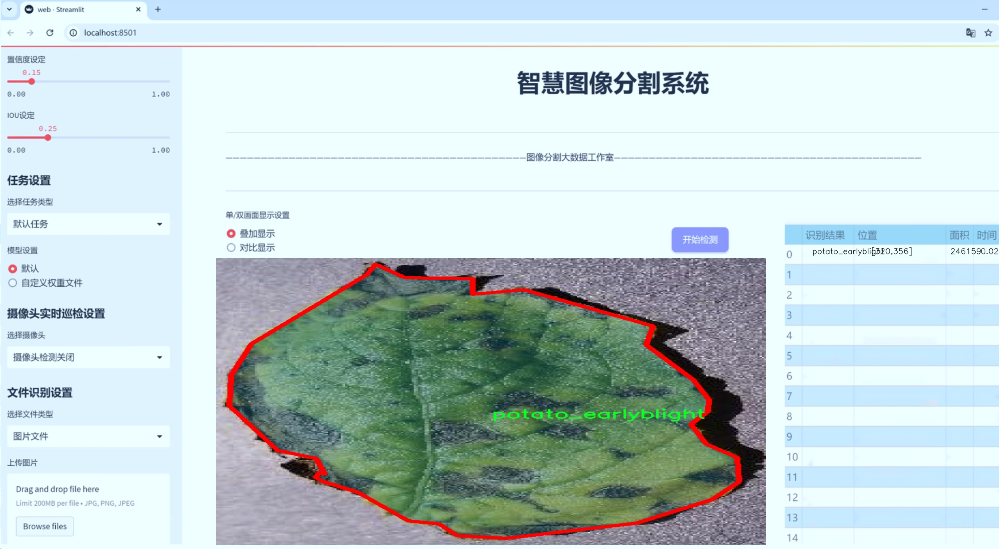
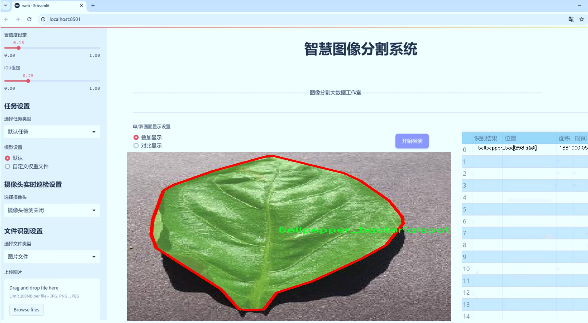
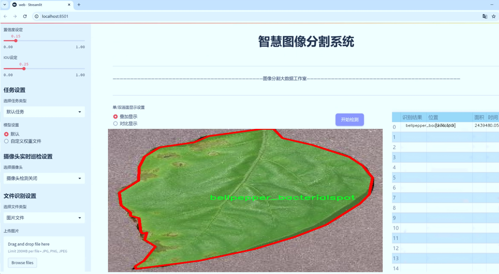
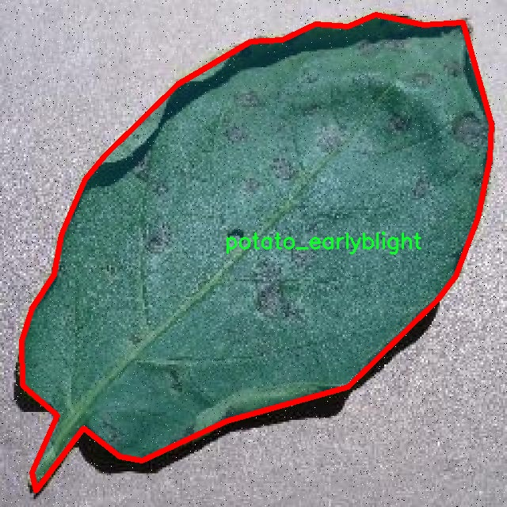
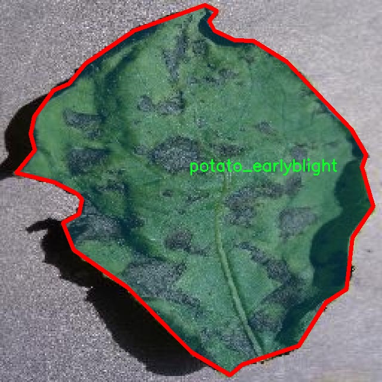
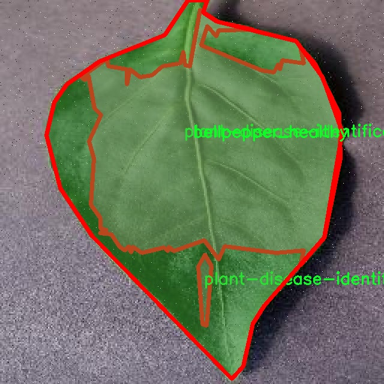
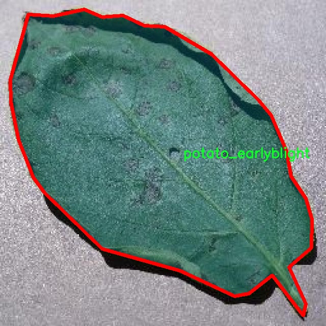

# 植物叶片病害图像分割系统源码＆数据集分享
 [yolov8-seg-C2f-ODConv＆yolov8-seg-RevCol等50+全套改进创新点发刊_一键训练教程_Web前端展示]

### 1.研究背景与意义

项目参考[ILSVRC ImageNet Large Scale Visual Recognition Challenge](https://gitee.com/YOLOv8_YOLOv11_Segmentation_Studio/projects)

项目来源[AAAI Global Al lnnovation Contest](https://kdocs.cn/l/cszuIiCKVNis)

研究背景与意义

随着全球人口的持续增长，农业生产面临着前所未有的挑战。植物病害不仅直接影响作物的产量和质量，还可能对生态环境造成深远的影响。因此，及时、准确地识别和诊断植物病害成为现代农业管理中不可或缺的一部分。传统的病害识别方法依赖于人工观察和经验判断，效率低下且容易出现误判。近年来，随着计算机视觉和深度学习技术的迅猛发展，基于图像处理的植物病害识别系统逐渐成为研究热点。特别是YOLO（You Only Look Once）系列模型，以其高效的实时目标检测能力，已被广泛应用于植物病害的识别与分类。

本研究旨在基于改进的YOLOv8模型，构建一个高效的植物叶片病害图像分割系统。该系统将利用包含7200张图像的“leaf instance”数据集，该数据集涵盖了29类不同的植物病害和健康状态，包括水稻、甘蔗、番茄和小麦等多种作物的病害类型。这些丰富的样本数据为模型的训练和验证提供了坚实的基础，使得系统能够在多样化的场景中进行有效的病害识别和分割。

在植物病害的研究中，图像分割技术尤为重要。通过精确的图像分割，可以有效地提取出病害区域，从而为后续的分析和处理提供准确的数据支持。改进的YOLOv8模型在目标检测的基础上，结合了图像分割的能力，能够实现对植物叶片病害的精准定位和分类。这种方法不仅提高了识别的准确性，还显著提升了处理速度，为农业生产提供了实时监测的可能。

此外，植物病害的早期识别和处理对于减少农药使用、提高作物产量具有重要意义。通过建立高效的病害识别系统，农民可以及时采取措施，降低病害对作物的影响，从而实现可持续农业发展。与此同时，该系统的推广应用也将推动农业智能化的发展，为实现精准农业提供技术支持。

综上所述，基于改进YOLOv8的植物叶片病害图像分割系统的研究，不仅具有重要的理论意义，也具备广泛的应用前景。通过该系统的开发与应用，能够有效提升植物病害的识别效率，为农业生产提供科学依据，促进农业的可持续发展。未来，随着技术的不断进步，该系统有望在更大范围内推广应用，为全球农业的健康发展贡献力量。

### 2.图片演示







##### 注意：由于此博客编辑较早，上面“2.图片演示”和“3.视频演示”展示的系统图片或者视频可能为老版本，新版本在老版本的基础上升级如下：（实际效果以升级的新版本为准）

  （1）适配了YOLOV8的“目标检测”模型和“实例分割”模型，通过加载相应的权重（.pt）文件即可自适应加载模型。

  （2）支持“图片识别”、“视频识别”、“摄像头实时识别”三种识别模式。

  （3）支持“图片识别”、“视频识别”、“摄像头实时识别”三种识别结果保存导出，解决手动导出（容易卡顿出现爆内存）存在的问题，识别完自动保存结果并导出到tempDir中。

  （4）支持Web前端系统中的标题、背景图等自定义修改，后面提供修改教程。

  另外本项目提供训练的数据集和训练教程,暂不提供权重文件（best.pt）,需要您按照教程进行训练后实现图片演示和Web前端界面演示的效果。

### 3.视频演示

[3.1 视频演示](https://www.bilibili.com/video/BV1JBmNYgEuH/)

### 4.数据集信息展示

##### 4.1 本项目数据集详细数据（类别数＆类别名）

nc: 29
names: ['Rice_bacterial_Blight', 'Rice_brown_spot', 'Sugarcane-Healthy', 'Sugarcane-Mosaic', 'Sugarcane-Moscai', 'Sugarcane-RedRot', 'Sugarcane-Rust', 'Sugarcane-yellow', 'Wheat-Healthy', 'Wheat-stripe-rust', 'bellpepper_bacterialspot', 'bellpepper_healthy', 'plant-disease-identification', 'potato_earlyblight', 'potato_healthy', 'potato_late_blight', 'rice_healthy', 'rice_tungro', 'tomato_bacterial_spot', 'tomato_early_blight', 'tomato_healthy', 'tomato_leaf_blight', 'tomato_leaf_mold', 'tomato_mosaic_virus', 'tomato_septoria_leaf_spot', 'tomato_target_spot', 'tomato_two_spotted_spider_mite', 'tomato_yellow_leaf_curl_virus', 'wheat-septoria']


##### 4.2 本项目数据集信息介绍

数据集信息展示

在现代农业生产中，植物病害的早期识别与处理至关重要。为此，构建一个高效的图像分割系统以准确识别和分类植物叶片病害显得尤为重要。本研究所采用的数据集名为“leaf instance”，其设计旨在为改进YOLOv8-seg模型提供丰富的训练数据，进而提升其在植物叶片病害图像分割任务中的表现。

“leaf instance”数据集包含29个不同的类别，涵盖了多种常见的植物病害和健康状态。这些类别不仅包括主要农作物如水稻、小麦和甘蔗的健康与病害状态，还涉及到多种蔬菜的病害情况，如番茄和甜椒等。这种多样性使得数据集在训练过程中能够有效地模拟真实农业环境中的复杂性，从而提高模型的泛化能力。

具体而言，数据集中包含的类别包括“Rice_bacterial_Blight”、“Rice_brown_spot”、“Sugarcane-Healthy”、“Sugarcane-Mosaic”、“Sugarcane-RedRot”、“Sugarcane-Rust”、“Sugarcane-yellow”、“Wheat-Healthy”、“Wheat-stripe-rust”等。每一个类别都代表了特定的植物病害或健康状态，这些病害在农业生产中常常导致严重的经济损失。因此，能够准确识别这些病害对于农民及时采取防治措施、减少损失具有重要意义。

此外，数据集中还包括“bellpepper_bacterialspot”、“bellpepper_healthy”、“potato_earlyblight”、“potato_healthy”、“potato_late_blight”等类别，这些都是在全球范围内广泛种植的作物。通过对这些作物的病害进行深入分析，研究人员能够更好地理解不同病害的特征及其对植物生长的影响，从而为后续的病害防治策略提供科学依据。

在图像数据的收集过程中，研究团队采用了多种拍摄条件和环境，以确保数据集的多样性和代表性。这包括不同的光照条件、拍摄角度以及植物生长阶段等，力求使模型在面对各种实际情况时都能保持较高的识别准确率。数据集中的每一张图像都经过精细标注，确保模型在训练过程中能够获得准确的监督信息。

通过使用“leaf instance”数据集，改进后的YOLOv8-seg模型能够在植物叶片病害的图像分割任务中实现更高的精度和效率。这不仅为植物病害的自动识别提供了强有力的技术支持，也为农业生产的智能化发展奠定了基础。未来，随着数据集的不断扩展和模型的进一步优化，期望能够在更广泛的农业场景中实现实时监测和精准管理，助力可持续农业的发展。










### 5.全套项目环境部署视频教程（零基础手把手教学）

[5.1 环境部署教程链接（零基础手把手教学）](https://www.bilibili.com/video/BV1jG4Ve4E9t/?vd_source=bc9aec86d164b67a7004b996143742dc)


[5.2 安装Python虚拟环境创建和依赖库安装视频教程链接（零基础手把手教学）](https://www.bilibili.com/video/BV1nA4VeYEze/?vd_source=bc9aec86d164b67a7004b996143742dc)

### 6.手把手YOLOV8-seg训练视频教程（零基础小白有手就能学会）

[6.1 手把手YOLOV8-seg训练视频教程（零基础小白有手就能学会）](https://www.bilibili.com/video/BV1cA4VeYETe/?vd_source=bc9aec86d164b67a7004b996143742dc)


按照上面的训练视频教程链接加载项目提供的数据集，运行train.py即可开始训练



     Epoch   gpu_mem       box       obj       cls    labels  img_size
     1/200     0G   0.01576   0.01955  0.007536        22      1280: 100%|██████████| 849/849 [14:42<00:00,  1.04s/it]
               Class     Images     Labels          P          R     mAP@.5 mAP@.5:.95: 100%|██████████| 213/213 [01:14<00:00,  2.87it/s]
                 all       3395      17314      0.994      0.957      0.0957      0.0843

     Epoch   gpu_mem       box       obj       cls    labels  img_size
     2/200     0G   0.01578   0.01923  0.007006        22      1280: 100%|██████████| 849/849 [14:44<00:00,  1.04s/it]
               Class     Images     Labels          P          R     mAP@.5 mAP@.5:.95: 100%|██████████| 213/213 [01:12<00:00,  2.95it/s]
                 all       3395      17314      0.996      0.956      0.0957      0.0845

     Epoch   gpu_mem       box       obj       cls    labels  img_size
     3/200     0G   0.01561    0.0191  0.006895        27      1280: 100%|██████████| 849/849 [10:56<00:00,  1.29it/s]
               Class     Images     Labels          P          R     mAP@.5 mAP@.5:.95: 100%|███████   | 187/213 [00:52<00:00,  4.04it/s]
                 all       3395      17314      0.996      0.957      0.0957      0.0845


### 7.50+种全套YOLOV8-seg创新点代码加载调参视频教程（一键加载写好的改进模型的配置文件）

[7.1 50+种全套YOLOV8-seg创新点代码加载调参视频教程（一键加载写好的改进模型的配置文件）](https://www.bilibili.com/video/BV1Hw4VePEXv/?vd_source=bc9aec86d164b67a7004b996143742dc)

### 8.YOLOV8-seg图像分割算法原理

原始YOLOv8-seg算法原理

YOLOv8-seg算法是基于YOLOv8模型的一项重要扩展，旨在实现高效的目标检测与分割任务。该算法的提出是为了应对计算机视觉领域日益增长的需求，尤其是在实时性和准确性之间的平衡。YOLOv8模型由Ultralytics团队在2023年1月推出，继承了YOLO系列模型的优良传统，并在此基础上进行了多项创新和改进，使其在目标检测和图像分割方面都表现出色。

YOLOv8-seg的核心结构依然遵循YOLO系列模型的基本框架，包括Backbone、Neck和Head三个主要部分。Backbone部分负责特征提取，Neck部分则用于特征融合，而Head部分则实现最终的目标检测和分割任务。具体来说，YOLOv8-seg的Backbone采用了一系列卷积和反卷积层，结合残差连接和瓶颈结构，旨在提高特征提取的效率和精度。相较于前代模型，YOLOv8在Backbone中引入了C2f模块，这一模块不仅继承了C3模块的优点，还借鉴了YOLOv7中的ELAN思想，增加了跳层连接的数量，从而增强了梯度流的丰富性，使得模型在训练过程中能够更好地捕捉到多层次的特征信息。

在Neck部分，YOLOv8-seg通过多尺度特征融合技术，将来自Backbone不同阶段的特征图进行有效整合。这一过程不仅提升了模型对不同尺度目标的捕捉能力，还增强了其对复杂场景的适应性。这种特征融合的策略对于分割任务尤为重要，因为目标的形状和大小可能存在较大差异，合理的特征融合能够显著提高分割的精度和鲁棒性。

在Head部分，YOLOv8-seg采用了解耦头的设计思路，将目标检测和分割任务分开处理。具体而言，YOLOv8-seg设有多个并行的检测头，分别负责提取类别和位置特征。这种设计的优势在于，分类任务更加关注特征图中与已知类别的相似性，而定位任务则更加注重边界框与真实框之间的关系。通过这种解耦设计，YOLOv8-seg在收敛速度和预测精度上均有显著提升。此外，YOLOv8-seg还引入了无锚框结构，直接预测目标的中心位置，并通过任务对齐学习（Task Alignment Learning, TAL）来优化正负样本的区分，进一步提升了模型的性能。

在数据增强方面，YOLOv8-seg对Mosaic数据增强的使用进行了调整。在训练的最后10个epoch中，停止使用Mosaic数据增强，以避免其对数据真实分布的破坏。这一改进旨在确保模型能够更好地学习到真实场景中的特征，从而提升其在实际应用中的表现。

值得一提的是，YOLOv8-seg在模型性能上取得了显著的进展。在COCO数据集上的实验结果显示，YOLOv8-seg在相同模型尺寸下，参数量没有显著增加的情况下，达到了更高的精度。同时，推理速度也得到了优化，使得该模型在实时性要求较高的应用场景中表现出色。这些优势使得YOLOv8-seg成为当前目标检测与分割领域的一项重要工具，尤其适用于需要高效处理的任务，如智能监控、自动驾驶和机器人视觉等。

综上所述，YOLOv8-seg算法在原有YOLOv8模型的基础上，通过一系列结构性改进和创新，提升了目标检测与分割的性能。其高效的特征提取、灵活的特征融合以及精确的任务处理能力，使得YOLOv8-seg在计算机视觉领域中具有广泛的应用前景。随着技术的不断发展，YOLOv8-seg有望在更多实际场景中发挥重要作用，推动计算机视觉技术的进一步进步。


### 9.系统功能展示（检测对象为举例，实际内容以本项目数据集为准）

图9.1.系统支持检测结果表格显示

  图9.2.系统支持置信度和IOU阈值手动调节

  图9.3.系统支持自定义加载权重文件best.pt(需要你通过步骤5中训练获得)

  图9.4.系统支持摄像头实时识别

  图9.5.系统支持图片识别

  图9.6.系统支持视频识别

  图9.7.系统支持识别结果文件自动保存

  图9.8.系统支持Excel导出检测结果数据


### 10.50+种全套YOLOV8-seg创新点原理讲解（非科班也可以轻松写刊发刊，V11版本正在科研待更新）

#### 10.1 由于篇幅限制，每个创新点的具体原理讲解就不一一展开，具体见下列网址中的创新点对应子项目的技术原理博客网址【Blog】：


[10.1 50+种全套YOLOV8-seg创新点原理讲解链接](https://gitee.com/qunmasj/good)

#### 10.2 部分改进模块原理讲解(完整的改进原理见上图和技术博客链接)【如果此小节的图加载失败可以通过CSDN或者Github搜索该博客的标题访问原始博客，原始博客图片显示正常】

### YOLOv8简介
YOLOv8是一种目标检测模型，是基于YOLO (You Only Look Once)系列算法发展而来的最新版本。它的核心思想是将目标检测任务转化为一个回归问题，通过单次前向传播即可直接预测出图像中的多个目标的位置和类别。
YOLOv8的网络结构采用了Darknet作为其主干网络，主要由卷积层和池化层构成。与之前的版本相比，YOLOv8在网络结构上进行了改进，引入了更多的卷积层和残差模块，以提高模型的准确性和鲁棒性。
YOLOv8采用了一种特征金字塔网络(Feature Pyramid Network,FPN)的结构，通过在不同层级上融合多尺度的特征信息，可以对不同尺度的目标进行有效的检测。此外，YOLOv8还引入了一种自适应感知域(Adaptive Anchors
的机制，通过自适应地学习目标的尺度和
长宽比，提高了模型对于不同尺度和形状目标的检测效果。
总体来说，YOLOv8结构模型综合了多个先进的目标检测技术，在保证检测速度的同时提升了检测精度和鲁棒性，被广泛应用于实时目标检测任务中。


#### yolov8网络模型结构图

YOLOv8 (You Only Look Once version 8)是一种目标检测算法，它在实时场景下可以快速准确地检测图像中的目标。
YOLOv8的网络模型结构基于Darknet框架，由一系列卷积层、池化层和全连接层组成。主要包含以下几个组件:
1.输入层:接收输入图像。
2.卷积层:使用不同尺寸的卷积核来提取图像特征。
3.残差块(Residual blocks):通过使用跳跃连接(skip connections）来解决梯度消失问题，使得网络更容易训练。
4.上采样层(Upsample layers):通过插值操作将特征图的尺寸放大，以便在不同尺度上进行目标检测。
5.池化层:用于减小特征图的尺寸，同时保留重要的特征。
6.1x1卷积层:用于降低通道数，减少网络参数量。
7.3x3卷积层:用于进—步提取和组合特征。
8.全连接层:用于最后的目标分类和定位。
YOLOv8的网络结构采用了多个不同尺度的特征图来检测不同大小的目标，从而提高了目标检测的准确性和多尺度性能。
请注意，YOLOv8网络模型结构图的具体细节可能因YOLO版本和实现方式而有所不同。


#### yolov8模型结构
YOLOv8模型是一种目标检测模型，其结构是基于YOLOv3模型进行改进的。模型结构可以分为主干网络和检测头两个部分。
主干网络是一种由Darknet-53构成的卷积神经网络。Darknet-53是一个经过多层卷积和残差连接构建起来的深度神经网络。它能够提取图像的特征信息，并将这些信息传递给检测头。
检测头是YOLOv8的关键部分，它负责在图像中定位和识别目标。检测头由一系列卷积层和全连接层组成。在每个检测头中，会生成一组锚框，并针对每个锚框预测目标的类别和位置信息。
YOLOv8模型使用了预训练的权重，其中在COCO数据集上进行了训练。这意味着该模型已经通过大规模数据集的学习，具有一定的目标检测能力。

### RT-DETR骨干网络HGNetv2简介
#### RT-DETR横空出世
前几天被百度的RT-DETR刷屏，参考该博客提出的目标检测新范式对原始DETR的网络结构进行了调整和优化，以提高计算速度和减小模型大小。这包括使用更轻量级的基础网络和调整Transformer结构。并且，摒弃了nms处理的detr结构与传统的物体检测方法相比，不仅训练是端到端的，检测也能端到端，这意味着整个网络在训练过程中一起进行优化，推理过程不需要昂贵的后处理代价，这有助于提高模型的泛化能力和性能。


当然，人们对RT-DETR之所以产生浓厚的兴趣，我觉得大概率还是对YOLO系列审美疲劳了，就算是出到了YOLO10086，我还是只想用YOLOv5和YOLOv7的框架来魔改做业务。。

#### 初识HGNet
看到RT-DETR的性能指标，发现指标最好的两个模型backbone都是用的HGNetv2，毫无疑问，和当时的picodet一样，骨干都是使用百度自家的网络。初识HGNet的时候，当时是参加了第四届百度网盘图像处理大赛，文档图像方向识别专题赛道，简单来说，就是使用分类网络对一些文档截图或者图片进行方向角度分类。


当时的方案并没有那么快定型，通常是打榜过程发现哪个网络性能好就使用哪个网络做魔改，而且木有显卡，只能蹭Ai Studio的平台，不过v100一天8小时的实验时间有点短，这也注定了大模型用不了。 

流水的模型，铁打的炼丹人，最后发现HGNet-tiny各方面指标都很符合我们的预期，后面就一直围绕它魔改。当然，比赛打榜是目的，学习才是享受过程，当时看到效果还可以，便开始折腾起了HGNet的网络架构，我们可以看到，PP-HGNet 针对 GPU 设备，对目前 GPU 友好的网络做了分析和归纳，尽可能多的使用 3x3 标准卷积（计算密度最高），PP-HGNet是由多个HG-Block组成，细节如下：


ConvBNAct是啥？简单聊一聊，就是Conv+BN+Act，CV Man应该最熟悉不过了：
```python
class ConvBNAct(TheseusLayer):
    def __init__(self,
                 in_channels,
                 out_channels,
                 kernel_size,
                 stride,
                 groups=1,
                 use_act=True):
        super().__init__()
        self.use_act = use_act
        self.conv = Conv2D(
            in_channels,
            out_channels,
            kernel_size,
            stride,
            padding=(kernel_size - 1) // 2,
            groups=groups,
            bias_attr=False)
        self.bn = BatchNorm2D(
            out_channels,
            weight_attr=ParamAttr(regularizer=L2Decay(0.0)),
            bias_attr=ParamAttr(regularizer=L2Decay(0.0)))
        if self.use_act:
            self.act = ReLU()
 
    def forward(self, x):
        x = self.conv(x)
        x = self.bn(x)
        if self.use_act:
            x = self.act(x)
        return x 
```
且标准卷积的数量随层数深度增加而增多，从而得到一个有利于 GPU 推理的骨干网络，同样速度下，精度也超越其他 CNN ，性价比也优于ViT-base模型。


另外，我们可以看到：

PP-HGNet 的第一层由channel为96的Stem模块构成，目的是为了减少参数量和计算量。PP-HGNet

Tiny的整体结构由四个HG Stage构成，而每个HG Stage主要由包含大量标准卷积的HG Block构成。

PP-HGNet的第三到第五层使用了使用了可学习的下采样层（LDS Layer），该层group为输入通道数，可达到降参降计算量的作用，且Tiny模型仅包含三个LDS Layer，并不会对GPU的利用率造成较大影响.

PP-HGNet的激活函数为Relu，常数级操作可保证该模型在硬件上的推理速度。

### 11.项目核心源码讲解（再也不用担心看不懂代码逻辑）

#### 11.1 ultralytics\models\sam\__init__.py

下面是对给定代码的核心部分进行提炼和详细注释的结果：

```python
# 引入Ultralytics YOLO 🚀，遵循AGPL-3.0许可证

# 从当前包中导入SAM模型
from .model import SAM

# 从当前包中导入预测器类
from .predict import Predictor

# 定义模块的公开接口，包含SAM模型和Predictor预测器
__all__ = 'SAM', 'Predictor'  # 公开的模块成员，允许外部访问
```

### 代码分析与注释：

1. **模块导入**：
   - `from .model import SAM`：从当前包（即模块）中导入`SAM`类或函数，`SAM`可能是一个用于目标检测或其他任务的模型。
   - `from .predict import Predictor`：从当前包中导入`Predictor`类，`Predictor`可能是一个用于执行预测的工具或类。

2. **公开接口定义**：
   - `__all__ = 'SAM', 'Predictor'`：这个特殊变量`__all__`用于定义模块的公共接口。它告诉`import *`语句时应该导入哪些成员。在这里，只有`SAM`和`Predictor`会被导入，其他未列出的成员将不会被导入。

通过这些注释，代码的核心功能和结构得以清晰呈现，便于理解其用途和功能。

这个文件是一个Python模块的初始化文件，位于`ultralytics/models/sam`目录下。文件的主要功能是导入该模块中的类和函数，并定义模块的公共接口。

首先，文件顶部的注释说明了该项目是Ultralytics YOLO的一部分，并且使用AGPL-3.0许可证。这表明该项目是开源的，用户可以自由使用和修改，但需要遵循相应的许可证条款。

接下来，文件通过相对导入的方式引入了两个组件：`SAM`和`Predictor`。`SAM`可能是一个模型类，而`Predictor`则可能是一个用于进行预测的类或函数。这种导入方式使得其他模块可以直接使用这些类，而不需要知道它们的具体实现细节。

最后，`__all__`变量被定义为一个元组，包含了`'SAM'`和`'Predictor'`。这个变量的作用是指定当使用`from module import *`语句时，哪些名称会被导入。这是一种控制模块公共接口的方式，确保用户只能访问到指定的类或函数，从而避免直接访问模块内部的实现细节。

总的来说，这个文件的作用是为`ultralytics.models.sam`模块提供一个清晰的接口，方便其他部分的代码进行调用，同时也保持了代码的组织性和可维护性。

#### 11.2 ui.py

以下是保留的核心代码部分，并添加了详细的中文注释：

```python
import sys
import subprocess

def run_script(script_path):
    """
    使用当前 Python 环境运行指定的脚本。

    Args:
        script_path (str): 要运行的脚本路径

    Returns:
        None
    """
    # 获取当前 Python 解释器的路径
    python_path = sys.executable

    # 构建运行命令，使用 streamlit 运行指定的脚本
    command = f'"{python_path}" -m streamlit run "{script_path}"'

    # 执行命令
    result = subprocess.run(command, shell=True)
    # 检查命令执行结果，如果返回码不为0，则表示出错
    if result.returncode != 0:
        print("脚本运行出错。")

# 主程序入口
if __name__ == "__main__":
    # 指定要运行的脚本路径
    script_path = "web.py"  # 这里可以替换为实际的脚本路径

    # 调用函数运行脚本
    run_script(script_path)
```

### 代码注释说明：
1. **导入模块**：
   - `sys`：用于访问与 Python 解释器紧密相关的变量和函数。
   - `subprocess`：用于创建新进程、连接到它们的输入/输出/错误管道，并获得返回码。

2. **`run_script` 函数**：
   - 接受一个参数 `script_path`，表示要运行的 Python 脚本的路径。
   - 使用 `sys.executable` 获取当前 Python 解释器的路径，以确保在正确的环境中运行脚本。
   - 构建命令字符串，使用 `streamlit` 模块运行指定的脚本。
   - 使用 `subprocess.run` 执行构建的命令，并通过 `shell=True` 允许在 shell 中执行命令。
   - 检查命令的返回码，如果不为0，表示脚本运行出错，打印错误信息。

3. **主程序入口**：
   - 使用 `if __name__ == "__main__":` 确保只有在直接运行该脚本时才会执行以下代码。
   - 指定要运行的脚本路径 `script_path`，可以根据需要进行修改。
   - 调用 `run_script` 函数来执行指定的脚本。

这个程序文件名为 `ui.py`，主要功能是通过当前的 Python 环境运行一个指定的脚本，具体是一个名为 `web.py` 的文件。程序首先导入了必要的模块，包括 `sys`、`os` 和 `subprocess`，以及一个自定义的路径处理函数 `abs_path`。

在 `run_script` 函数中，程序接受一个参数 `script_path`，该参数是要运行的脚本的路径。函数首先获取当前 Python 解释器的路径，这通过 `sys.executable` 实现。接着，程序构建一个命令字符串，使用 `streamlit` 模块来运行指定的脚本。命令的格式是 `"{python_path}" -m streamlit run "{script_path}"`，其中 `python_path` 是当前 Python 解释器的路径，`script_path` 是传入的脚本路径。

然后，程序使用 `subprocess.run` 方法执行这个命令，`shell=True` 表示在 shell 中执行该命令。执行完后，程序检查返回的结果码，如果不为零，说明脚本运行出错，程序会打印出“脚本运行出错。”的提示信息。

在文件的最后部分，程序通过 `if __name__ == "__main__":` 判断是否是直接运行该脚本。如果是，程序会调用 `abs_path` 函数获取 `web.py` 的绝对路径，并将其传递给 `run_script` 函数，从而启动脚本的运行。

总的来说，这个程序的主要目的是提供一个简单的接口，通过当前的 Python 环境来运行指定的 Streamlit 脚本，并处理可能出现的错误。

#### 11.3 ultralytics\nn\backbone\CSwomTramsformer.py

以下是提取后的核心代码部分，并附上详细的中文注释：

```python
import torch
import torch.nn as nn
import numpy as np

class Mlp(nn.Module):
    """多层感知机（MLP）模块"""
    def __init__(self, in_features, hidden_features=None, out_features=None, act_layer=nn.GELU, drop=0.):
        super().__init__()
        out_features = out_features or in_features  # 输出特征数
        hidden_features = hidden_features or in_features  # 隐藏层特征数
        self.fc1 = nn.Linear(in_features, hidden_features)  # 第一层线性变换
        self.act = act_layer()  # 激活函数
        self.fc2 = nn.Linear(hidden_features, out_features)  # 第二层线性变换
        self.drop = nn.Dropout(drop)  # Dropout层

    def forward(self, x):
        """前向传播"""
        x = self.fc1(x)  # 线性变换
        x = self.act(x)  # 激活
        x = self.drop(x)  # Dropout
        x = self.fc2(x)  # 线性变换
        x = self.drop(x)  # Dropout
        return x

class CSWinBlock(nn.Module):
    """CSWin Transformer中的一个基本块"""
    def __init__(self, dim, reso, num_heads, mlp_ratio=4., drop=0., attn_drop=0.):
        super().__init__()
        self.dim = dim  # 输入特征维度
        self.num_heads = num_heads  # 注意力头数
        self.mlp_ratio = mlp_ratio  # MLP的扩展比例
        self.qkv = nn.Linear(dim, dim * 3)  # 线性变换生成Q、K、V
        self.norm1 = nn.LayerNorm(dim)  # 第一层归一化
        self.attn = LePEAttention(dim, reso, num_heads=num_heads, attn_drop=attn_drop)  # 注意力模块
        self.mlp = Mlp(in_features=dim, hidden_features=int(dim * mlp_ratio), out_features=dim)  # MLP模块
        self.norm2 = nn.LayerNorm(dim)  # 第二层归一化

    def forward(self, x):
        """前向传播"""
        img = self.norm1(x)  # 归一化
        qkv = self.qkv(img).reshape(-1, 3, self.dim)  # 生成Q、K、V
        attn_out = self.attn(qkv)  # 注意力计算
        x = x + attn_out  # 残差连接
        x = x + self.mlp(self.norm2(x))  # MLP处理并残差连接
        return x

class CSWinTransformer(nn.Module):
    """CSWin Transformer模型"""
    def __init__(self, img_size=640, in_chans=3, num_classes=1000, embed_dim=96, depth=[2,2,6,2], num_heads=12):
        super().__init__()
        self.num_classes = num_classes  # 类别数
        self.embed_dim = embed_dim  # 嵌入维度
        self.stage1_conv_embed = nn.Sequential(
            nn.Conv2d(in_chans, embed_dim, 7, 4, 2),  # 初始卷积层
            nn.LayerNorm(embed_dim)  # 归一化层
        )
        self.stage1 = nn.ModuleList([
            CSWinBlock(dim=embed_dim, num_heads=num_heads, reso=img_size//4) for _ in range(depth[0])
        ])
        # 其他阶段的定义省略...

    def forward(self, x):
        """前向传播"""
        x = self.stage1_conv_embed(x)  # 初始卷积嵌入
        for blk in self.stage1:
            x = blk(x)  # 通过每个CSWinBlock
        return x

# 示例：创建模型并进行前向传播
if __name__ == '__main__':
    inputs = torch.randn((1, 3, 640, 640))  # 输入张量
    model = CSWinTransformer()  # 创建模型
    res = model(inputs)  # 前向传播
    print(res.size())  # 输出结果的尺寸
```

### 代码注释说明：
1. **Mlp类**：实现了一个简单的多层感知机，包括两个线性层和一个激活函数。支持Dropout以防止过拟合。
2. **CSWinBlock类**：这是CSWin Transformer的基本构建块，包含注意力机制和MLP。通过归一化和残差连接来增强模型的学习能力。
3. **CSWinTransformer类**：整个模型的实现，包含多个阶段的块（如CSWinBlock）。初始阶段通过卷积层进行特征嵌入，后续阶段则通过多个CSWinBlock进行特征提取。
4. **前向传播**：在`forward`方法中定义了输入数据如何通过模型流动，最终输出特征。

通过这些注释，代码的结构和功能变得更加清晰，便于理解和修改。

这个程序文件实现了CSWin Transformer模型，主要用于计算机视觉任务。文件开头包含版权信息和作者信息，接着导入了必要的库，包括PyTorch和一些用于图像处理和模型构建的工具。

首先，定义了一个多层感知机（Mlp）类，它包含两个线性层和一个激活函数（默认为GELU），用于处理输入特征并通过dropout层进行正则化。接下来，定义了LePEAttention类，这是一个自注意力机制的实现，使用了局部增强的自注意力（LePE），并支持不同的分辨率和分割大小。该类的核心功能是将输入的图像特征转换为窗口格式，以便进行注意力计算。

CSWinBlock类是CSWin Transformer的基本构建块，包含了多头自注意力机制和多层感知机。它将输入特征进行归一化处理，然后通过线性层生成查询、键和值，并应用LePEAttention进行特征提取。最后，使用dropout和残差连接将处理后的特征返回。

接下来，定义了两个辅助函数：img2windows和windows2img，用于在图像和窗口表示之间进行转换。Merge_Block类用于将特征图的分辨率减半，同时进行归一化处理。

CSWinTransformer类是整个模型的核心，包含多个阶段，每个阶段由多个CSWinBlock组成。它首先通过卷积层将输入图像嵌入到特征空间中，然后依次通过各个阶段的块进行特征提取和合并。模型支持不同的超参数配置，如图像大小、嵌入维度、深度等。

文件中还定义了一些辅助函数，用于加载预训练权重和更新模型权重。最后，提供了四个不同规模的模型构造函数（CSWin_tiny、CSWin_small、CSWin_base、CSWin_large），并在主程序中对这些模型进行了实例化和测试，输出了模型的特征图尺寸。

整体来看，这个文件实现了一个复杂的视觉变换器模型，利用自注意力机制和分层结构来提取图像特征，适用于各种计算机视觉任务。

#### 11.4 ultralytics\engine\results.py

以下是代码中最核心的部分，并附上详细的中文注释：

```python
class BaseTensor(SimpleClass):
    """基础张量类，提供额外的方法以便于操作和设备管理。"""

    def __init__(self, data, orig_shape) -> None:
        """
        初始化 BaseTensor，包含数据和原始形状。

        参数:
            data (torch.Tensor | np.ndarray): 预测结果，例如边界框、掩码和关键点。
            orig_shape (tuple): 图像的原始形状。
        """
        assert isinstance(data, (torch.Tensor, np.ndarray))  # 确保数据是张量或数组
        self.data = data  # 存储数据
        self.orig_shape = orig_shape  # 存储原始形状

    @property
    def shape(self):
        """返回数据张量的形状。"""
        return self.data.shape

    def cpu(self):
        """返回在CPU内存上的张量副本。"""
        return self if isinstance(self.data, np.ndarray) else self.__class__(self.data.cpu(), self.orig_shape)

    def numpy(self):
        """返回张量的numpy数组副本。"""
        return self if isinstance(self.data, np.ndarray) else self.__class__(self.data.numpy(), self.orig_shape)

    def cuda(self):
        """返回在GPU内存上的张量副本。"""
        return self.__class__(torch.as_tensor(self.data).cuda(), self.orig_shape)

    def to(self, *args, **kwargs):
        """返回具有指定设备和数据类型的张量副本。"""
        return self.__class__(torch.as_tensor(self.data).to(*args, **kwargs), self.orig_shape)

    def __len__(self):  # 重写len(results)
        """返回数据张量的长度。"""
        return len(self.data)

    def __getitem__(self, idx):
        """返回指定索引的数据张量副本。"""
        return self.__class__(self.data[idx], self.orig_shape)


class Results(SimpleClass):
    """
    存储和操作推理结果的类。

    参数:
        orig_img (numpy.ndarray): 原始图像的numpy数组。
        path (str): 图像文件的路径。
        names (dict): 类名字典。
        boxes (torch.tensor, optional): 每个检测的边界框坐标的2D张量。
        masks (torch.tensor, optional): 检测掩码的3D张量，每个掩码是一个二进制图像。
        probs (torch.tensor, optional): 每个类的概率的1D张量。
        keypoints (List[List[float]], optional): 每个对象的检测关键点列表。

    属性:
        orig_img (numpy.ndarray): 原始图像的numpy数组。
        orig_shape (tuple): 原始图像的形状（高度，宽度）。
        boxes (Boxes, optional): 包含检测边界框的Boxes对象。
        masks (Masks, optional): 包含检测掩码的Masks对象。
        probs (Probs, optional): 包含每个类概率的Probs对象。
        keypoints (Keypoints, optional): 包含每个对象检测关键点的Keypoints对象。
    """

    def __init__(self, orig_img, path, names, boxes=None, masks=None, probs=None, keypoints=None) -> None:
        """初始化 Results 类。"""
        self.orig_img = orig_img  # 存储原始图像
        self.orig_shape = orig_img.shape[:2]  # 存储原始图像的形状
        self.boxes = Boxes(boxes, self.orig_shape) if boxes is not None else None  # 初始化边界框
        self.masks = Masks(masks, self.orig_shape) if masks is not None else None  # 初始化掩码
        self.probs = Probs(probs) if probs is not None else None  # 初始化概率
        self.keypoints = Keypoints(keypoints, self.orig_shape) if keypoints is not None else None  # 初始化关键点
        self.names = names  # 存储类名
        self.path = path  # 存储图像路径

    def __getitem__(self, idx):
        """返回指定索引的Results对象。"""
        return self._apply('__getitem__', idx)

    def __len__(self):
        """返回Results对象中的检测数量。"""
        for k in ('boxes', 'masks', 'probs', 'keypoints'):
            v = getattr(self, k)
            if v is not None:
                return len(v)

    def update(self, boxes=None, masks=None, probs=None):
        """更新Results对象的边界框、掩码和概率属性。"""
        if boxes is not None:
            self.boxes = Boxes(boxes, self.orig_shape)  # 更新边界框
        if masks is not None:
            self.masks = Masks(masks, self.orig_shape)  # 更新掩码
        if probs is not None:
            self.probs = probs  # 更新概率

    def plot(self, conf=True, boxes=True, masks=True, probs=True):
        """
        在输入RGB图像上绘制检测结果。

        参数:
            conf (bool): 是否绘制检测置信度分数。
            boxes (bool): 是否绘制边界框。
            masks (bool): 是否绘制掩码。
            probs (bool): 是否绘制分类概率。

        返回:
            (numpy.ndarray): 带注释的图像的numpy数组。
        """
        # 绘制检测结果的逻辑...
        pass  # 省略具体实现

    def save_txt(self, txt_file, save_conf=False):
        """
        将预测结果保存到txt文件。

        参数:
            txt_file (str): txt文件路径。
            save_conf (bool): 是否保存置信度分数。
        """
        # 保存逻辑...
        pass  # 省略具体实现
```

### 代码说明：
1. **BaseTensor类**：这是一个基础类，封装了对张量的基本操作，如设备转换（CPU/GPU）和数据类型转换（numpy数组）。
2. **Results类**：这个类用于存储推理结果，包括原始图像、边界框、掩码、概率和关键点。它提供了更新和绘制结果的方法。

这些类是YOLO推理结果处理的核心部分，负责存储和操作检测到的对象信息。

这个程序文件是 Ultralytics YOLO 的一部分，主要用于处理推理结果，包括检测框、掩膜和关键点等。它定义了一些类，这些类提供了对推理结果的存储和操作功能。

首先，`BaseTensor` 类是一个基础类，提供了一些用于张量操作的方法，比如在 CPU 和 GPU 之间转换、返回 numpy 数组等。它的构造函数接受数据和原始图像的形状，并提供了一些属性和方法来获取张量的形状、长度和索引。

接下来是 `Results` 类，它用于存储和操作推理结果。构造函数接受原始图像、文件路径、类别名称以及可选的检测框、掩膜、概率和关键点等参数。该类还包含一些方法，如 `update` 用于更新检测框和掩膜，`plot` 用于在图像上绘制检测结果，`save_txt` 用于将预测结果保存到文本文件中，`tojson` 用于将结果转换为 JSON 格式等。

`Boxes`、`Masks`、`Keypoints` 和 `Probs` 类分别用于处理检测框、掩膜、关键点和分类概率。每个类都继承自 `BaseTensor`，并提供了特定于其功能的方法和属性。例如，`Boxes` 类提供了获取框的坐标、置信度和类别的方法，而 `Masks` 类则处理掩膜的像素坐标和归一化坐标。

`plot` 方法是 `Results` 类中的一个重要功能，它允许用户在输入图像上绘制检测结果，包括边界框、掩膜、关键点和分类概率等。用户可以通过设置参数来控制绘制的样式和内容。

总体来说，这个文件提供了一套完整的工具，用于处理 YOLO 模型的推理结果，方便用户进行后续的分析和可视化。

#### 11.5 ultralytics\models\sam\modules\tiny_encoder.py

以下是代码中最核心的部分，并附上详细的中文注释：

```python
import torch
import torch.nn as nn
import torch.nn.functional as F

class Conv2d_BN(torch.nn.Sequential):
    """一个顺序容器，执行2D卷积操作，后接批量归一化。"""

    def __init__(self, in_channels, out_channels, kernel_size=1, stride=1, padding=0, dilation=1, groups=1, bn_weight_init=1):
        """初始化卷积层和批量归一化层。"""
        super().__init__()
        # 添加卷积层
        self.add_module('c', torch.nn.Conv2d(in_channels, out_channels, kernel_size, stride, padding, dilation, groups, bias=False))
        # 添加批量归一化层
        bn = torch.nn.BatchNorm2d(out_channels)
        # 初始化批量归一化层的权重和偏置
        torch.nn.init.constant_(bn.weight, bn_weight_init)
        torch.nn.init.constant_(bn.bias, 0)
        self.add_module('bn', bn)


class PatchEmbed(nn.Module):
    """将图像嵌入为补丁，并将其投影到指定的嵌入维度。"""

    def __init__(self, in_chans, embed_dim, resolution, activation):
        """初始化补丁嵌入层。"""
        super().__init__()
        img_size = (resolution, resolution)  # 假设输入为正方形图像
        self.patches_resolution = (img_size[0] // 4, img_size[1] // 4)  # 计算补丁的分辨率
        self.in_chans = in_chans
        self.embed_dim = embed_dim
        n = embed_dim
        # 定义嵌入序列
        self.seq = nn.Sequential(
            Conv2d_BN(in_chans, n // 2, 3, 2, 1),  # 第一个卷积层
            activation(),  # 激活函数
            Conv2d_BN(n // 2, n, 3, 2, 1),  # 第二个卷积层
        )

    def forward(self, x):
        """将输入张量通过补丁嵌入模型的操作序列。"""
        return self.seq(x)


class TinyViT(nn.Module):
    """
    TinyViT架构，用于视觉任务。
    """

    def __init__(self, img_size=224, in_chans=3, num_classes=1000, embed_dims=[96, 192, 384, 768], depths=[2, 2, 6, 2], num_heads=[3, 6, 12, 24], window_sizes=[7, 7, 14, 7], mlp_ratio=4., drop_rate=0., drop_path_rate=0.1, use_checkpoint=False):
        """
        初始化TinyViT模型。
        """
        super().__init__()
        self.img_size = img_size
        self.num_classes = num_classes
        self.depths = depths
        self.num_layers = len(depths)
        self.mlp_ratio = mlp_ratio

        activation = nn.GELU  # 使用GELU激活函数

        # 初始化补丁嵌入层
        self.patch_embed = PatchEmbed(in_chans=in_chans, embed_dim=embed_dims[0], resolution=img_size, activation=activation)

        # 构建层
        self.layers = nn.ModuleList()
        for i_layer in range(self.num_layers):
            layer = BasicLayer(  # 假设BasicLayer是一个自定义的类
                dim=embed_dims[i_layer],
                input_resolution=(self.patch_embed.patches_resolution[0] // (2 ** i_layer), self.patch_embed.patches_resolution[1] // (2 ** i_layer)),
                depth=depths[i_layer],
                num_heads=num_heads[i_layer],
                window_size=window_sizes[i_layer],
                mlp_ratio=self.mlp_ratio,
                drop=drop_rate,
                use_checkpoint=use_checkpoint,
            )
            self.layers.append(layer)

        # 分类头
        self.head = nn.Linear(embed_dims[-1], num_classes) if num_classes > 0 else nn.Identity()

    def forward(self, x):
        """执行前向传播，返回模型的输出。"""
        x = self.patch_embed(x)  # 将输入图像嵌入为补丁
        for layer in self.layers:
            x = layer(x)  # 通过每一层
        return self.head(x)  # 最后通过分类头
```

### 代码说明：
1. **Conv2d_BN**：定义了一个卷积层后接批量归一化的模块，简化了卷积和归一化的组合使用。
2. **PatchEmbed**：将输入图像分割成补丁，并将其嵌入到一个更高维度的空间中，通常用于视觉任务中的特征提取。
3. **TinyViT**：这是整个模型的核心，包含了多个层的堆叠，每一层由多个TinyViT块组成，最终通过一个线性层进行分类。

这个程序文件实现了一个名为TinyViT的视觉模型架构，主要用于图像处理任务。TinyViT是一个轻量级的视觉变换器，结合了卷积神经网络（CNN）和自注意力机制，旨在提高图像分类和其他视觉任务的性能。

文件中首先导入了一些必要的库，包括PyTorch和相关的模块。接着定义了一系列的类，每个类负责模型的不同部分。

Conv2d_BN类是一个顺序容器，执行二维卷积操作并随后进行批量归一化。它的构造函数接收多个参数，如输入和输出通道数、卷积核大小、步幅等，并初始化卷积层和批量归一化层。

PatchEmbed类用于将输入图像分割成小块，并将这些小块投影到指定的嵌入维度。它通过两个卷积层实现了图像的下采样和特征提取。

MBConv类实现了移动反向瓶颈卷积层，属于EfficientNet架构的一部分。它通过多个卷积层和激活函数构建了一个高效的卷积块，支持深度可分离卷积和短路连接。

PatchMerging类负责合并相邻的特征块，并将其投影到新的维度。它通过一系列卷积操作来实现特征的融合。

ConvLayer类是一个包含多个MBConv层的卷积层，可以选择性地对输出进行下采样，并支持梯度检查点以节省内存。

Mlp类实现了多层感知机（MLP），用于变换器架构中的前馈网络。它包括层归一化和两个全连接层。

Attention类实现了多头自注意力机制，支持空间感知。它通过查询、键和值的线性变换来计算注意力，并使用可训练的注意力偏置来增强模型的表现。

TinyViTBlock类结合了自注意力和局部卷积，构成了TinyViT的基本模块。它在输入上应用注意力机制，并通过局部卷积进一步处理特征。

BasicLayer类表示TinyViT中的一个基本层，包含多个TinyViTBlock。它还可以选择性地进行下采样。

LayerNorm2d类实现了二维的层归一化，用于规范化特征图。

TinyViT类是整个模型的主类，负责构建模型的各个层。它接收多个参数，包括输入图像的大小、输入通道数、类别数、嵌入维度、深度、注意力头数等。模型的构造过程中，首先创建了图像嵌入层，然后根据指定的深度和其他参数构建多个层。最后，定义了前向传播方法，执行输入的特征提取和分类。

整个文件实现了一个高效且灵活的视觉模型架构，适用于各种视觉任务，并提供了丰富的配置选项以满足不同的需求。

#### 11.6 ultralytics\nn\extra_modules\ops_dcnv3\test.py

以下是代码中最核心的部分，并附上详细的中文注释：

```python
import torch
from functions.dcnv3_func import DCNv3Function, dcnv3_core_pytorch

# 输入和输出的尺寸
H_in, W_in = 8, 8  # 输入图像的高度和宽度
N, M, D = 2, 4, 16  # N: 批量大小, M: 通道数, D: 特征维度
Kh, Kw = 3, 3  # 卷积核的高度和宽度
remove_center = False  # 是否移除中心点
P = Kh * Kw - remove_center  # 卷积核的有效点数
offset_scale = 2.0  # 偏移缩放因子
pad = 1  # 填充大小
dilation = 1  # 膨胀率
stride = 1  # 步幅
# 计算输出的高度和宽度
H_out = (H_in + 2 * pad - (dilation * (Kh - 1) + 1)) // stride + 1
W_out = (W_in + 2 * pad - (dilation * (Kw - 1) + 1)) // stride + 1

torch.manual_seed(3)  # 设置随机种子以确保可重复性

@torch.no_grad()
def check_forward_equal_with_pytorch_double():
    # 创建输入、偏移和掩码
    input = torch.rand(N, H_in, W_in, M*D).cuda() * 0.01  # 输入张量
    offset = torch.rand(N, H_out, W_out, M*P*2).cuda() * 10  # 偏移张量
    mask = torch.rand(N, H_out, W_out, M, P).cuda() + 1e-5  # 掩码张量
    mask /= mask.sum(-1, keepdim=True)  # 归一化掩码
    mask = mask.reshape(N, H_out, W_out, M*P)  # 重塑掩码形状

    # 使用PyTorch的实现计算输出
    output_pytorch = dcnv3_core_pytorch(
        input.double(),
        offset.double(),
        mask.double(),
        Kh, Kw, stride, stride, Kh // 2, Kw // 2, dilation, dilation, M, D, offset_scale, remove_center).detach().cpu()

    # 使用自定义的DCNv3函数计算输出
    output_cuda = DCNv3Function.apply(
        input.double(),
        offset.double(),
        mask.double(),
        Kh, Kw, stride, stride, Kh // 2, Kw // 2, dilation, dilation, M, D, offset_scale,
        im2col_step=2, remove_center).detach().cpu()

    # 检查两个输出是否相近
    fwdok = torch.allclose(output_cuda, output_pytorch)
    max_abs_err = (output_cuda - output_pytorch).abs().max()  # 最大绝对误差
    max_rel_err = ((output_cuda - output_pytorch).abs() / output_pytorch.abs()).max()  # 最大相对误差
    print('>>> forward double')
    print(f'* {fwdok} check_forward_equal_with_pytorch_double: max_abs_err {max_abs_err:.2e} max_rel_err {max_rel_err:.2e}')

if __name__ == '__main__':
    check_forward_equal_with_pytorch_double()  # 执行前向一致性检查
```

### 代码核心部分说明：
1. **输入参数设置**：定义了输入图像的尺寸、批量大小、通道数和特征维度等参数。
2. **输出尺寸计算**：根据输入尺寸和卷积参数计算输出的高度和宽度。
3. **前向一致性检查**：`check_forward_equal_with_pytorch_double` 函数用于检查自定义的 DCNv3 实现与 PyTorch 内置实现的输出是否一致。
   - 创建随机输入、偏移和掩码。
   - 使用两种方法计算输出并比较结果。
   - 输出最大绝对误差和最大相对误差，以评估一致性。

### 注意事项：
- 代码中涉及的 `DCNv3Function` 和 `dcnv3_core_pytorch` 是自定义的函数，假设它们在 `functions.dcnv3_func` 模块中定义。
- 代码中的 `.cuda()` 表示将张量移动到 GPU 上进行计算，确保运行在支持 CUDA 的环境中。

这个程序文件是一个用于测试和验证深度学习模型中 DCNv3（Deformable Convolutional Networks v3）功能的脚本。它主要通过比较自定义的 CUDA 实现与 PyTorch 原生实现的结果来确保功能的正确性。以下是代码的详细说明。

首先，程序导入了一些必要的库，包括 PyTorch 和一些数学函数。接着，定义了一些参数，如输入和输出的高度和宽度、通道数、卷积核的大小、偏移量的缩放因子等。这些参数用于设置测试的输入数据和卷积操作的配置。

程序中定义了多个函数来进行不同的测试。`check_forward_equal_with_pytorch_double` 和 `check_forward_equal_with_pytorch_float` 函数分别用于检查双精度和单精度下的前向传播结果是否一致。它们生成随机输入、偏移量和掩码，然后调用自定义的 DCNv3 函数和 PyTorch 的实现，最后比较两者的输出结果，计算最大绝对误差和相对误差，并打印结果。

`check_backward_equal_with_pytorch_double` 和 `check_backward_equal_with_pytorch_float` 函数则用于检查反向传播的梯度是否一致。它们同样生成随机输入和参数，计算前向传播的输出，并通过调用 `.backward()` 方法计算梯度。然后，它们比较自定义实现和 PyTorch 实现的梯度，输出误差信息。

`check_time_cost` 函数用于测试前向传播的时间开销。它生成较大的输入数据并多次调用 DCNv3 函数，记录每次调用的时间，以评估性能。

在 `__main__` 块中，程序依次调用上述测试函数。首先检查前向传播的结果，然后检查不同通道数下的反向传播结果，最后测试不同步长下的时间开销。

总体而言，这个程序的主要目的是确保 DCNv3 的实现与 PyTorch 的实现相符，并评估其性能。通过多种测试方法，程序能够有效地验证功能的正确性和效率。

### 12.系统整体结构（节选）

### 整体功能和构架概括

该项目是 Ultralytics YOLO 系列的一个实现，主要用于计算机视觉任务，如目标检测、图像分割和跟踪等。项目的架构分为多个模块，每个模块负责特定的功能，包括模型定义、结果处理、训练、验证和测试等。整体上，项目旨在提供一个高效、灵活且易于扩展的框架，以支持各种视觉任务的研究和应用。

以下是项目中各个文件的功能整理：

| 文件路径                                             | 功能描述                                                                                       |
|----------------------------------------------------|-----------------------------------------------------------------------------------------------|
| `ultralytics/models/sam/__init__.py`               | 初始化模块，导入 `SAM` 和 `Predictor` 类，定义模块的公共接口。                                 |
| `ui.py`                                            | 提供一个接口，通过当前 Python 环境运行指定的 Streamlit 脚本。                                 |
| `ultralytics/nn/backbone/CSwomTramsformer.py`     | 实现 CSWin Transformer 模型，结合自注意力机制和卷积层，用于图像特征提取。                     |
| `ultralytics/engine/results.py`                    | 处理推理结果，包括检测框、掩膜和关键点等，提供结果的存储、可视化和保存功能。                   |
| `ultralytics/models/utils/ops.py`                  | 提供一些自定义的操作和功能，可能包括卷积、池化等基础操作的实现。                               |
| `ultralytics/models/sam/modules/tiny_encoder.py`   | 实现 TinyViT 模型架构，结合卷积和自注意力机制，用于高效的图像处理。                           |
| `ultralytics/nn/extra_modules/ops_dcnv3/test.py`  | 测试 DCNv3 的实现，验证其与 PyTorch 原生实现的功能一致性和性能。                               |
| `__init__.py`                                      | 通常用于标识一个目录为 Python 包，可能包含包的初始化代码。                                     |
| `train.py`                                         | 负责模型的训练过程，包括数据加载、模型构建、损失计算和优化等。                               |
| `ultralytics/trackers/bot_sort.py`                 | 实现 BOT-SORT 跟踪算法，用于在视频序列中进行目标跟踪。                                       |
| `ultralytics/utils/checks.py`                      | 提供一些检查和验证功能，确保模型和数据的有效性。                                             |
| `ultralytics/models/fastsam/utils.py`              | 提供 FastSAM 模型的辅助功能和工具，可能包括数据处理和后处理等。                               |
| `ultralytics/engine/validator.py`                  | 负责模型验证过程，评估模型在验证集上的性能，计算指标如精度、召回率等。                       |

这个表格总结了项目中各个文件的主要功能，帮助理解项目的整体结构和各个模块之间的关系。

注意：由于此博客编辑较早，上面“11.项目核心源码讲解（再也不用担心看不懂代码逻辑）”中部分代码可能会优化升级，仅供参考学习，完整“训练源码”、“Web前端界面”和“50+种创新点源码”以“14.完整训练+Web前端界面+50+种创新点源码、数据集获取”的内容为准。

### 13.图片、视频、摄像头图像分割Demo(去除WebUI)代码

在这个博客小节中，我们将讨论如何在不使用WebUI的情况下，实现图像分割模型的使用。本项目代码已经优化整合，方便用户将分割功能嵌入自己的项目中。
核心功能包括图片、视频、摄像头图像的分割，ROI区域的轮廓提取、类别分类、周长计算、面积计算、圆度计算以及颜色提取等。
这些功能提供了良好的二次开发基础。

### 核心代码解读

以下是主要代码片段，我们会为每一块代码进行详细的批注解释：

```python
import random
import cv2
import numpy as np
from PIL import ImageFont, ImageDraw, Image
from hashlib import md5
from model import Web_Detector
from chinese_name_list import Label_list

# 根据名称生成颜色
def generate_color_based_on_name(name):
    ......

# 计算多边形面积
def calculate_polygon_area(points):
    return cv2.contourArea(points.astype(np.float32))

...
# 绘制中文标签
def draw_with_chinese(image, text, position, font_size=20, color=(255, 0, 0)):
    image_pil = Image.fromarray(cv2.cvtColor(image, cv2.COLOR_BGR2RGB))
    draw = ImageDraw.Draw(image_pil)
    font = ImageFont.truetype("simsun.ttc", font_size, encoding="unic")
    draw.text(position, text, font=font, fill=color)
    return cv2.cvtColor(np.array(image_pil), cv2.COLOR_RGB2BGR)

# 动态调整参数
def adjust_parameter(image_size, base_size=1000):
    max_size = max(image_size)
    return max_size / base_size

# 绘制检测结果
def draw_detections(image, info, alpha=0.2):
    name, bbox, conf, cls_id, mask = info['class_name'], info['bbox'], info['score'], info['class_id'], info['mask']
    adjust_param = adjust_parameter(image.shape[:2])
    spacing = int(20 * adjust_param)

    if mask is None:
        x1, y1, x2, y2 = bbox
        aim_frame_area = (x2 - x1) * (y2 - y1)
        cv2.rectangle(image, (x1, y1), (x2, y2), color=(0, 0, 255), thickness=int(3 * adjust_param))
        image = draw_with_chinese(image, name, (x1, y1 - int(30 * adjust_param)), font_size=int(35 * adjust_param))
        y_offset = int(50 * adjust_param)  # 类别名称上方绘制，其下方留出空间
    else:
        mask_points = np.concatenate(mask)
        aim_frame_area = calculate_polygon_area(mask_points)
        mask_color = generate_color_based_on_name(name)
        try:
            overlay = image.copy()
            cv2.fillPoly(overlay, [mask_points.astype(np.int32)], mask_color)
            image = cv2.addWeighted(overlay, 0.3, image, 0.7, 0)
            cv2.drawContours(image, [mask_points.astype(np.int32)], -1, (0, 0, 255), thickness=int(8 * adjust_param))

            # 计算面积、周长、圆度
            area = cv2.contourArea(mask_points.astype(np.int32))
            perimeter = cv2.arcLength(mask_points.astype(np.int32), True)
            ......

            # 计算色彩
            mask = np.zeros(image.shape[:2], dtype=np.uint8)
            cv2.drawContours(mask, [mask_points.astype(np.int32)], -1, 255, -1)
            color_points = cv2.findNonZero(mask)
            ......

            # 绘制类别名称
            x, y = np.min(mask_points, axis=0).astype(int)
            image = draw_with_chinese(image, name, (x, y - int(30 * adjust_param)), font_size=int(35 * adjust_param))
            y_offset = int(50 * adjust_param)

            # 绘制面积、周长、圆度和色彩值
            metrics = [("Area", area), ("Perimeter", perimeter), ("Circularity", circularity), ("Color", color_str)]
            for idx, (metric_name, metric_value) in enumerate(metrics):
                ......

    return image, aim_frame_area

# 处理每帧图像
def process_frame(model, image):
    pre_img = model.preprocess(image)
    pred = model.predict(pre_img)
    det = pred[0] if det is not None and len(det)
    if det:
        det_info = model.postprocess(pred)
        for info in det_info:
            image, _ = draw_detections(image, info)
    return image

if __name__ == "__main__":
    cls_name = Label_list
    model = Web_Detector()
    model.load_model("./weights/yolov8s-seg.pt")

    # 摄像头实时处理
    cap = cv2.VideoCapture(0)
    while cap.isOpened():
        ret, frame = cap.read()
        if not ret:
            break
        ......

    # 图片处理
    image_path = './icon/OIP.jpg'
    image = cv2.imread(image_path)
    if image is not None:
        processed_image = process_frame(model, image)
        ......

    # 视频处理
    video_path = ''  # 输入视频的路径
    cap = cv2.VideoCapture(video_path)
    while cap.isOpened():
        ret, frame = cap.read()
        ......
```


### 14.完整训练+Web前端界面+50+种创新点源码、数据集获取


# [下载链接：https://mbd.pub/o/bread/Zp2Xmppx](https://mbd.pub/o/bread/Zp2Xmppx)